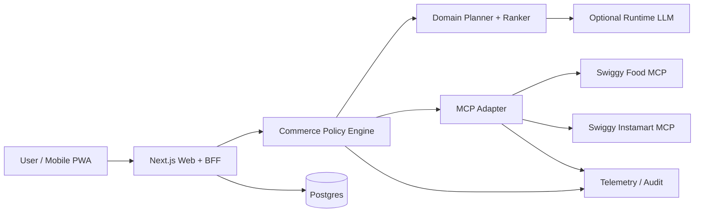
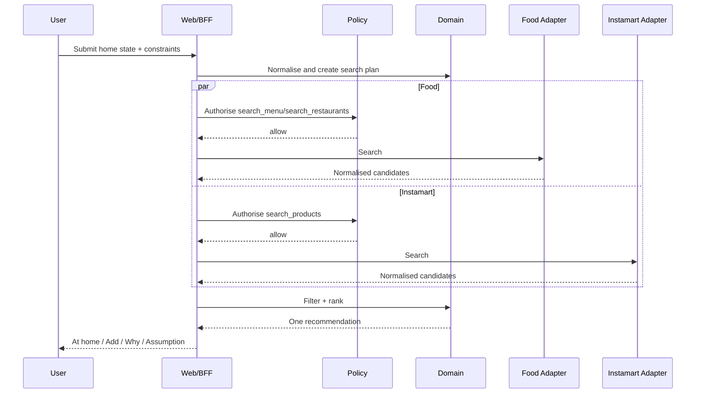

# Architecture

## 1. System intent

Finish My Dinner is a controlled agentic application. The LLM assists with language and semantic planning; deterministic application code controls permissions, external tools, state, and any future financial action.

## 2. Context diagram



## 3. Trust boundaries

1. Browser → application server  
   Untrusted user input. Authenticated session and CSRF required for writes.

2. Application server → runtime model  
   Send redacted structured facts only. Validate all output.

3. Application server → Swiggy MCP  
   Per-user bearer token, server-side only. Tool output is untrusted data.

4. Application server → persistence  
   Encrypt tokens and minimise retention.

5. CI/deployment → runtime environment  
   Protected secrets and capability flags. Preview cannot reach production MCP.

## 4. Components

### Web/PWA

Owns presentation, client navigation, form state, and safe API calls. It does not own Swiggy tokens or MCP schemas.

### API/BFF

Owns sessions, auth callback, input validation, request tracing, and composition.

### Commerce policy engine

The only component that decides which tool can be called. Inputs:

- Active milestone
- Environment
- User permission state
- Session state
- Tool class

Output:

```ts
type PolicyDecision =
  | { allowed: true; tool: string }
  | { allowed: false; reason: string };
```

### Domain package

Pure functions:

- Home-state normalisation
- Missing-job inference
- Search-plan generation
- Hard filtering
- Ranking
- User-facing reason codes
- State transitions

### Planner

Optional LLM-assisted adapter behind `PlannerPort`. It has no tool client and no permission state.

### MCP adapter

Owns transport, auth header injection, tool discovery, request validation, response normalisation, retry, and correlation IDs.

Ports:

```ts
interface DiscoveryPort {
  getAddresses(): Promise<Address[]>;
  searchFood(input: FoodSearchInput): Promise<Candidate[]>;
  searchInstamart(input: InstamartSearchInput): Promise<Candidate[]>;
}
```

M0 exports only `DiscoveryPort`. Future commerce ports are separate packages/interfaces so they cannot be accidentally imported.

### MCP stub

Implements `DiscoveryPort` with deterministic fixtures and fault injection.

### Persistence

Minimum tables:

```text
users
swiggy_connections
product_sessions
recommendations
feedback
consents
operational_events
```

Future:

```text
permission_grants
cart_digests
order_digests
agent_incidents
```

Do not create future tables unless the milestone activates them.

### Telemetry

Structured events, spans, redaction, metrics, and trace correlation. It must not store raw full tool payloads.

## 5. Request sequence



## 6. Runtime mode

```ts
type McpEnvironment = "stub" | "staging" | "production";
type CapabilityLevel = "read_only" | "cart_only" | "single_order";
```

Startup validates the pair. `stub/read_only` is the default.

## 7. Error boundary

External errors become stable internal classes:

```text
AUTH
BAD_INPUT
TIMEOUT
UPSTREAM
DOMAIN
SCHEMA
RATE_LIMIT
INTERNAL
```

Raw provider messages are logged only after redaction and are not shown directly to users.

## 8. Schema drift

- Call `tools/list` on connection/startup or controlled integration check.
- Validate expected tool names and required properties.
- Reads may degrade when optional fields change.
- Mutations fail closed on any uncertain contract.
- CI drift workflow opens issues; it does not auto-patch code.

## 9. Future commerce separation

When M1/M2 activates, introduce separate ports:

```ts
interface CartPort { /* read, plan, mutate, reconcile */ }
interface OrderPort { /* confirm, place, recover, track */ }
```

The runtime model never receives either port. The policy engine is the only caller.
