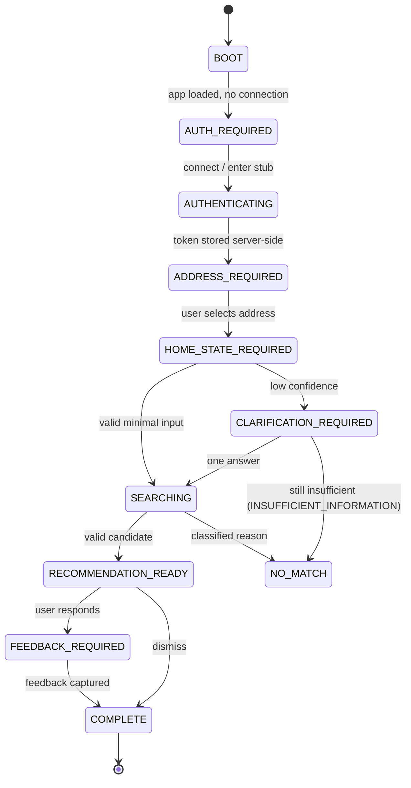
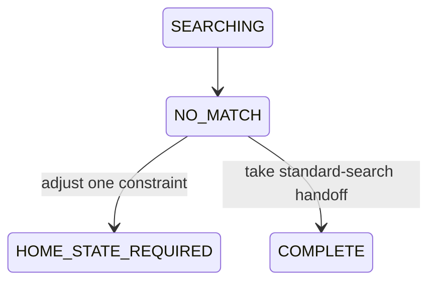
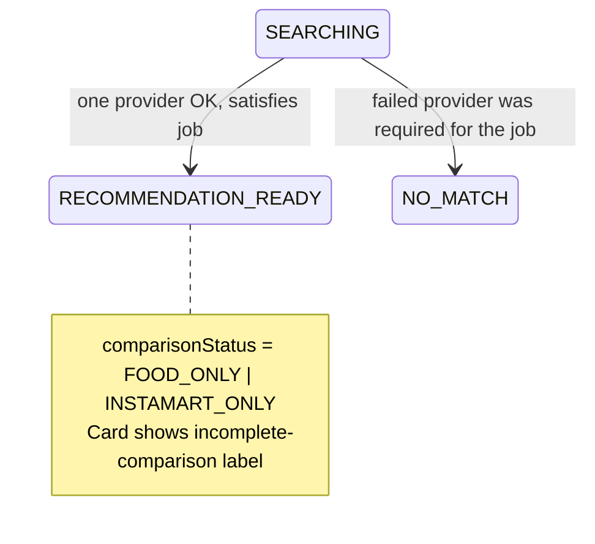

# UI Specification — Finish My Dinner

Owner: Claude (product-design & frontend lead)
Task: `FMD-003 — UX and visual specification`
Status: Complete for `M0_READ_ONLY_VALIDATION`
Last updated: 2026-06-25

This document is the normative UX contract for the M0 read-only validation PWA. It is documentation only. No application code, no shared-contract change, and no cart/order affordance is introduced here. Where this spec needs a data field, it is expressed as a *proposal* to Codex (see §10), not as a contract edit.

When this spec and `AI_PRD.md` disagree, `AI_PRD.md` wins. Safety invariants in `AGENTS.md` win over both.

---

## 0. Design thesis

The interface should feel like **completing a plate**, not shopping a marketplace.

The user already has part of dinner. The product's only job is to name the one missing piece and show one good way to get it. Every screen reduces decision load; nothing invites browsing. The primary interaction is a **guided chip-first form** (UX-001, DEC-005), never an open chat.

Three principles drive every decision below:

1. **One truth per screen.** Each state answers exactly one question the user has right now ("what's at home?", "what should I add?", "did anything break?").
2. **Show the seams.** What is at home, what to add, why, and every assumption are always visible and visually distinct (GOAL-004).
3. **Never overclaim.** Price is an estimate, diet is only stated when known, nothing is "ordered." Read-only is a feature, surfaced honestly (UX-005, INV-015, INV-011/health).

---

## 1. Requirement traceability

| This spec section | Satisfies |
|---|---|
| §2 Screen inventory | UX-002, FLOW-001..004, state machine §7, AT-204 |
| §3 Flows & transitions | FLOW-001..004, §7 transition table |
| §4 Component inventory | UX-003, UX-004, UX-006, AT-206/207 |
| §5 Design tokens | UX-008, UX-009 |
| §6 Copy matrix | UX-004..007, FAIL-001, §14 error model |
| §7 Accessibility | UX-008, AT-201/202/203/205 |
| §8 Responsive | UX-009, AT-205 |
| §9 No-regression guardrails | UX-010, INV-001/002/015, DEC-019..023 |
| §10 Proposed contract fields | DOM-004/005, §11 routes (proposal only) |
| §11 State→screen matrix | AT-204 |
| §12 Self-review checklist | §1 review criteria, AT-2xx |

---

## 2. Screen inventory

Every M0 `ProductState` (AI_PRD §7) maps to exactly one primary screen or overlay. No commerce state (`CART_*`, `ORDER_*`) is reachable or rendered as active in M0.

| # | Screen | Drives state(s) | One truth it delivers |
|---|---|---|---|
| S1 | **Welcome / connect** | `BOOT`, `AUTH_REQUIRED` | What FMD does + that it is read-only; connect Swiggy or enter stub mode |
| S2 | **Connecting** | `AUTHENTICATING` | Auth in progress; nothing committed |
| S3 | **Address select** | `ADDRESS_REQUIRED` | Choose one saved address; no auto-pick (INV-004, MCP-005) |
| S4 | **Home-state input** | `HOME_STATE_REQUIRED` | What's already at home + minimal constraints, chip-first |
| S5 | **One clarification** | `CLARIFICATION_REQUIRED` | One bounded question, then proceed or stop (FLOW-002) |
| S6 | **Searching** | `SEARCHING` | Which provider check is in progress; nothing ordered (UX-006) |
| S7 | **Recommendation** | `RECOMMENDATION_READY` | At home / Add / Why / Assumption / Status — one primary only |
| S7a | **Targeted alternative** | `RECOMMENDATION_READY` (post-reject) | One revised option tied to the rejection reason (DEC-006) |
| S8 | **No match** | `NO_MATCH` | The exact constraint that blocked a result + one adjustment (FLOW-003) |
| S9 | **Provider partial failure** | `RECOVERABLE_ERROR` (`FOOD_UNAVAILABLE` / `INSTAMART_UNAVAILABLE`) | Comparison incomplete, nothing changed, here is the valid side (FLOW-004) |
| S10 | **Auth expiry** | `AUTH_REQUIRED` (interrupt) | Reconnect; your input is preserved safely (INV-008/token) |
| S11 | **Generic safe failure** | `RECOVERABLE_ERROR` / `FATAL_ERROR` | Plain error, nothing changed, one next action, trace ID (FAIL-001) |
| S12 | **Feedback** | `FEEDBACK_REQUIRED` | Useful? Would order? Why not? (MET-004) |
| S13 | **Session complete** | `COMPLETE` | Done; start again or adjust |
| S14 | **Privacy & connection settings** | (accessible from any screen) | What is stored, disconnect Swiggy, consent toggle (SEC-006) |

Notes:
- S6 and S9 share the same status-list component; S9 is S6 with one provider marked failed.
- S10 is an overlay that can appear over any screen on a 401 / `-32001`; underlying draft input is retained client-side only (no token, no PII to LLM — SEC-003).
- S14 is reachable via a persistent settings affordance in the app header on S3–S13.

---

## 3. Flows & state transitions

### 3.1 Happy path (FLOW-001)



### 3.2 One-clarification budget (FLOW-002)

At most one bounded question. After the single answer the system either searches or returns `INSUFFICIENT_INFORMATION` (rendered as S8 no-match). Never a second open question, never an open chat (AT-004, AT-005).

### 3.3 No viable completion (FLOW-003)



S8 names the exact blocking reason (budget / vegetarian / serviceability / single-surface / provider). It offers **one** constraint adjustment or a standard-search handoff. It never fabricates a meal.

### 3.4 Partial provider failure (FLOW-004)



If one MCP server fails, continue with the other **only when it can satisfy the missing-component job**, and label the comparison incomplete. Otherwise show S9.

### 3.5 Auth expiry interrupt (any state)

```mermaid
stateDiagram-v2
    state "any state" as ANY
    ANY --> AUTH_REQUIRED: 401 or JSON-RPC -32001
    AUTH_REQUIRED --> AUTHENTICATING: reconnect
    AUTHENTICATING --> ADDRESS_REQUIRED: resume; draft preserved
```



S10 overlay. Draft home-state input is preserved client-side; tokens are never in the browser, so reconnect is a fresh OAuth run (MCP-002, SEC-002).

---

## 4. Component inventory & hierarchy

Components below map to future `packages/ui` primitives. No component renders a cart, quantity stepper, "add to order," or checkout control in M0.

```text
AppShell
├── AppHeader            (product mark, address summary chip, settings entry)
├── StatusRegion         (aria-live polite; async announcements)
├── Screen (one of S1–S14)
│   ├── Welcome
│   │   ├── ValueStatement
│   │   ├── ReadOnlyBoundaryNotice
│   │   └── ConnectActions (Connect Swiggy / Use stub)
│   ├── AddressList
│   │   └── AddressRow * n   (radio semantics, single select)
│   ├── HomeStateForm
│   │   ├── ChipGroup (home components)        ← UX-003 primary chips
│   │   ├── ConstraintControls
│   │   │   ├── ServingsToggle (1 / 2)
│   │   │   ├── DietToggle (Veg / Mixed)
│   │   │   ├── BudgetField (max ₹)
│   │   │   ├── MealWeightToggle (Light / Regular)
│   │   │   └── ExclusionInput (chips)
│   │   └── SubmitButton
│   ├── ClarificationPrompt (single bounded question, ≤4 options)
│   ├── ProgressList
│   │   └── ProgressRow * n   (Checking Food / Checking Instamart / Comparing)
│   ├── RecommendationCard            ← UX-004
│   │   ├── AtHomeSection
│   │   ├── AddSection (item, merchant, surface badge)
│   │   ├── WhySection
│   │   ├── AssumptionSection (correctable)
│   │   ├── StatusSection (estimate price · surface · ETA-if-present)
│   │   ├── ComparisonNotice (only when FOOD_ONLY / INSTAMART_ONLY)
│   │   └── ResponseActions
│   │       ├── PrimaryResponse (Useful / Not useful)
│   │       └── AlternativeTrigger ("Change one thing")
│   ├── AlternativeReasonSheet (Too expensive / Too slow / Too heavy / Wrong type / Not enough / Don't trust / Other)
│   ├── NoMatchPanel (reason + single adjustment + handoff)
│   ├── ErrorPanel (code copy, "nothing changed", next action, trace ID)
│   ├── FeedbackForm (useful · would order · rejection reason)
│   └── SettingsPanel (stored data summary, disconnect, consent toggle)
└── HandoffNotice         (non-interactive; standard Swiggy search handoff only)
```

### 4.1 Recommendation card anatomy (UX-004, AT-206/207)

The card must make **AT HOME** (what the user already has) visually distinct from **ADD** (what to obtain). Use a labelled two-zone layout, distinct background tokens, and a divider — distinction must not rely on colour alone (UX-008).

```text
┌─────────────────────────────────────┐
│ AT HOME                             │  surface.base, text.secondary label
│ Rice + curd                         │  text.primary
├─────────────────────────────────────┤  border.default divider
│ ADD                  [ Food ]       │  surface.elevated, badge = surface tag
│ Rajma 450 ml — Home Plate           │  text.primary, emphasis
│                                     │
│ WHY                                 │
│ Adds a main dish to the rice you    │
│ already have.                       │
│                                     │
│ ASSUMPTION                ✎ correct │  text.muted; correct = re-open input
│ Rice is enough for one person.      │
│                                     │
│ STATUS                              │
│ ₹180 item-price estimate · Food ·   │  state.warning accent on "estimate"
│ ETA 25 min (if returned)            │
│                                     │
│ ─ Comparison: Instamart unavailable │  shown only when incomplete
├─────────────────────────────────────┤
│ [ Useful ]      [ Not useful ]      │  PrimaryResponse
│ Change one thing                    │  AlternativeTrigger (text button)
└─────────────────────────────────────┘
```

Exactly **one** primary recommendation per screen (AT-207, GOAL-002). No second card, no list, no "see more options." `AlternativeTrigger` replaces the current card in place; it does not add a card.

---

## 5. Semantic design tokens

Define semantic tokens, not product-specific hex inside components. Components reference token names only. Values below are reference defaults; final palette is tuned for WCAG 2.2 AA (≥4.5:1 body text, ≥3:1 large text and non-text UI). No Swiggy brand colour or asset is used.

### 5.1 Colour (light)

| Token | Value | Intent |
|---|---|---|
| `surface.base` | `#FFFFFF` | App background |
| `surface.elevated` | `#F5F5F4` | Cards, the ADD zone |
| `surface.sunken` | `#ECEBEA` | Input wells |
| `text.primary` | `#1C1B1A` | Primary content |
| `text.secondary` | `#4A4845` | Section labels |
| `text.muted` | `#6E6B67` | Assumptions, hints |
| `border.default` | `#D9D7D4` | Dividers, input borders |
| `action.primary` | `#1F6F4A` | Primary action (calm green, not Swiggy orange) |
| `action.primary.text` | `#FFFFFF` | Text on primary |
| `action.secondary` | `#1C1B1A` | Secondary/outline action |
| `state.success` | `#1F6F4A` | Provider check passed |
| `state.warning` | `#9A6700` | "estimate" / incomplete comparison |
| `state.error` | `#B42318` | Errors |
| `focus.ring` | `#1F6F4A` | 2px visible focus outline + 2px offset |

### 5.2 Colour (dark)

| Token | Value |
|---|---|
| `surface.base` | `#161513` |
| `surface.elevated` | `#211F1D` |
| `surface.sunken` | `#0F0E0D` |
| `text.primary` | `#F3F1EF` |
| `text.secondary` | `#C9C6C2` |
| `text.muted` | `#9A968F` |
| `border.default` | `#3A3835` |
| `action.primary` | `#4FB286` |
| `state.warning` | `#E0A100` |
| `state.error` | `#F2766A` |
| `focus.ring` | `#4FB286` |

State is never carried by colour alone (UX-008): pair every state colour with an icon and/or text label (e.g. ⚠ + "estimate", ✓ + "Food checked").

### 5.3 Space

`space.0=0 · space.1=4px · space.2=8px · space.3=12px · space.4=16px · space.5=24px · space.6=32px · space.7=48px`. Base rhythm 4px.

### 5.4 Radius

`radius.sm=6px · radius.md=10px · radius.lg=16px · radius.pill=999px` (chips).

### 5.5 Type

| Token | Size / line | Use |
|---|---|---|
| `type.display` | 24 / 30, 600 | Screen title |
| `type.heading` | 18 / 24, 600 | Card section group |
| `type.label` | 12 / 16, 600, tracked, uppercase | AT HOME / ADD / WHY |
| `type.body` | 16 / 24, 400 | Content (min 16px to avoid iOS zoom) |
| `type.caption` | 13 / 18, 400 | Status, trace ID |

### 5.6 Motion

`motion.fast=120ms · motion.base=200ms · motion.slow=320ms`, ease-out. Under `prefers-reduced-motion: reduce`, all non-essential transition/animation is disabled and progress is conveyed by text/state change only (UX-008).

---

## 6. Copy matrix

Tone is direct, calm, specific, non-judgmental, non-anthropomorphic (UX-007). No medical/allergy/nutrition claim (INV-011/014). Price language follows UX-005. `{…}` are data placeholders filled from validated contract data, never invented (INV-003/005).

### 6.1 Onboarding / connection (S1)

| Element | Copy |
|---|---|
| Title | Finish your dinner |
| Body | You already have part of dinner. Tell us what's at home and we'll find the one thing worth adding from Swiggy. |
| Read-only notice | Read-only mode. We can search and recommend. We can't add to a cart or place an order. |
| Primary action | Connect Swiggy |
| Secondary action | Try a sample (stub mode) |
| Disclaimer | Not affiliated with or endorsed by Swiggy. |

### 6.2 Connecting (S2)

| Element | Copy |
|---|---|
| Status | Connecting your Swiggy account… |
| Sub | Nothing is ordered. You'll choose an address next. |

### 6.3 Address selection (S3)

| Element | Copy |
|---|---|
| Title | Where are you eating? |
| Hint | Pick a saved address. We use it to check what can reach you. |
| Row | {label} · {shortAddress} |
| Empty | No saved addresses found. Add one in Swiggy, then reconnect. |
| Primary action | Use this address |

No address is preselected (INV-004).

### 6.4 Home-state input (S4)

| Element | Copy |
|---|---|
| Title | What's already at home? |
| Hint | Tap what you have. A couple is enough. |
| Chips | Rice · Rotis · Dal/curry · Sabzi · Eggs · Bread · Curd/raita · Leftovers, not enough · Other |
| Servings | For one · For two |
| Diet | Vegetarian · Mixed |
| Budget | Max ₹ {value} |
| Weight | Light · Regular |
| Exclusions | Skip anything? (e.g. mushroom) |
| Submit | Find what's missing |
| Validation (no chip) | Pick at least one thing you have, or choose "Leftovers, not enough." |

Common state reachable in ≤3 taps: one chip + Submit, with sensible defaults (For one, Mixed) (AT-201, GOAL-001).

### 6.5 Search progress (S6) — UX-006 factual status only

| Step | Copy |
|---|---|
| 1 | Checking Food… |
| 2 | Checking Instamart… |
| 3 | Comparing valid options… |
| Slow | Still checking. This can take a few seconds. |

No private reasoning / chain-of-thought is shown (UX-006, DEC-005 logging rule).

### 6.6 Recommendation (S7) — UX-004

| Slot | Copy pattern |
|---|---|
| AT HOME | {homeSummary} |
| ADD | {item} — {merchantName} |
| Surface badge | Food / Instamart |
| WHY | {why} |
| ASSUMPTION | {assumption}  ·  link: "Not right? Adjust" |
| STATUS | ₹{amount} item-price estimate · {surface} · {eta?} |
| Fees note | Final fees aren't available in read-only mode. |
| Useful | Useful |
| Not useful | Not useful |
| Alternative trigger | Change one thing |

Diet line appears **only** when diet is known; if `diet = UNKNOWN`, show nothing rather than implying vegetarian (AT-009, DEC-004).

### 6.7 Targeted alternative (S7a)

| Element | Copy |
|---|---|
| Sheet title | What should change? |
| Options | Too expensive · Too slow · Too heavy · Wrong type · Not enough food · Don't trust this place · Other |
| Confirm | Show another option |
| Result preface | Here's one more, adjusted for "{reason}". |
| No alt available | No better single option fits that change. {one adjustment or handoff} |

One alternative maximum (DEC-006/014).

### 6.8 No match (S8) — one reason, one action (FLOW-003)

| `NoMatchReason` | Copy | Offered action |
|---|---|---|
| Over budget | Nothing fit under ₹{max}. Nothing was ordered. | Raise budget / standard search |
| No vegetarian match | No vegetarian option completed this. Nothing was ordered. | Switch to Mixed / standard search |
| Not serviceable | Nothing serviceable reached {address} right now. | Try another address / standard search |
| Single-surface unavailable | We couldn't complete this from one surface. | Adjust constraints / standard search |
| Provider unavailable | Search is unavailable right now. Nothing was ordered. | Try again / standard search |
| Insufficient information | We still couldn't tell what's missing. | Edit what's at home |

Standard-search handoff is a non-interactive notice (no order CTA) (INV-001, UX-010).

### 6.9 Provider partial failure (S9) — FLOW-004

| Case | Copy |
|---|---|
| Food failed, Instamart valid | Food didn't respond, so this comparison is incomplete. Nothing was added or ordered. Here's the valid Instamart option. |
| Instamart failed, Food valid | Instamart didn't respond, so this comparison is incomplete. Nothing was added or ordered. Here's the valid Food option. |
| Comparison badge | Comparison incomplete |

### 6.10 Auth expiry (S10)

| Element | Copy |
|---|---|
| Title | Your Swiggy session ended |
| Body | Reconnect to keep going. What you entered is still here. Nothing was ordered. |
| Action | Reconnect Swiggy |

### 6.11 Generic safe failure (S11) — FAIL-001

| Element | Copy |
|---|---|
| Title | Something went wrong |
| Body | We hit an unexpected problem. Nothing was added or ordered. |
| Action | Try again |
| Trace | Reference: {traceId} |

Each public error states: what happened, whether anything changed (it didn't), one safe next action, and a trace ID (FAIL-001).

### 6.12 Feedback (S12) — MET-004

| Element | Copy |
|---|---|
| Q1 | Was this useful? — Useful / Not useful |
| Q2 | Would you order it? — Would order / Wouldn't order |
| Q3 (if not useful) | What was off? — {rejection reasons from §6.7} |
| Thanks | Thanks — this helps us decide if Finish My Dinner is worth building. |

### 6.13 Settings / privacy (S14)

| Element | Copy |
|---|---|
| Title | Privacy & connection |
| Stored | We keep your typed note for 24 hours and your feedback for 30 days. |
| Consent toggle | Allow storing my anonymised home-state for research |
| Disconnect | Disconnect Swiggy |
| Disconnect confirm | This removes your connection and deletes the stored token. Continue? |

---

## 7. Accessibility behaviour (UX-008, WCAG 2.2 AA)

### 7.1 Focus management

- On screen change, move focus to the new screen's `h1`/title (programmatically focusable, `tabindex="-1"`).
- After async resolves (S6 → S7/S8/S9), move focus to the result heading; do not strand focus on a now-removed progress row.
- S10 auth overlay traps focus until reconnect or dismiss; on close, return focus to the triggering control.
- Visible focus ring on every interactive element using `focus.ring`, 2px, 2px offset, never `outline: none` without replacement.

### 7.2 Screen-reader announcements

- A single `aria-live="polite"` `StatusRegion` in `AppShell` announces progress and results: "Checking Food", "Checking Instamart", "Recommendation ready: add Rajma from Food", "No match: over budget" (AT-202).
- Use `aria-live="assertive"` only for errors and auth expiry.
- Progress rows expose state via text, not colour: "Food — checked", "Instamart — failed".
- The recommendation card uses a labelled region (`aria-labelledby`) so AT HOME vs ADD are announced as distinct groups (AT-206).

### 7.3 Keyboard & touch targets

- Full flow operable by keyboard alone: chips are toggle buttons (Space/Enter), address rows are radios (arrow keys), all actions reachable in logical tab order (AT-203).
- Minimum target 44×44 px (UX-008); chips and toggles meet this with padding even when visually compact.
- No interaction depends on hover or pointer-only gestures.

### 7.4 Reduced motion

- Respect `prefers-reduced-motion: reduce`: disable progress spinners/transitions; convey progress via text state changes only (§5.6).

### 7.5 Validation & error semantics

- Inputs use `aria-invalid` + `aria-describedby` pointing to the error text.
- Errors state both the problem and the next available action (UX-008, FAIL-001), e.g. "Pick at least one thing you have."
- Colour never the sole signal: pair with icon + text (§5.2).

### 7.6 Accessibility acceptance mapping

| Test | Covered by |
|---|---|
| AT-201 common state ≤3 taps | §6.4 defaults + single-chip submit |
| AT-202 SR announces async result | §7.2 StatusRegion |
| AT-203 keyboard-only completes | §7.3 |
| AT-205 360px no horizontal overflow | §8 |

---

## 8. Responsive target (UX-009)

- Optimise first for **360–430 px** phone widths. Single column, full-width cards, sticky submit on input screen.
- No horizontal scroll at 360 px (AT-205); chips wrap, never overflow.
- Desktop / tablet: centre the same mobile task surface (max content width ≈ 480 px) on `surface.base`. It is a centred mobile task, not a dense dashboard.
- Tap-comfortable spacing (`space.3`+) between interactive rows.

---

## 9. No-regression guardrails (UX-010, invariants)

This product must **not** include, now or as an "active" affordance:

- Infinite scroll or paginated feeds.
- More than one primary recommendation (AT-207).
- A restaurant / cuisine feed (PRD-004, DEC-019).
- A mood or "what are you craving?" selector (NON-003).
- Social discovery, ads, or sponsored ranking (UX-010).
- A generic chatbot prompt as the primary surface (UX-001, DEC-005).
- Any active cart, quantity, "add to order," coupon, or checkout control (INV-001/002, M0 forbidden tools).
- A "final total" or hidden-fee claim, or any fabricated discount (UX-005, INV-015).
- Swiggy brand colour/logo reuse or any implied official endorsement.

Future-state (cart/order) UI may appear **only** as clearly-labelled, non-interactive documentation, never as a live control in M0.

---

## 10. Proposed contract field needs (proposal to Codex — not a contract change)

This task does **not** edit `packages/contracts`. The fields below are what the UI needs to render the screens above; they are offered to Codex for FMD-002 / a follow-up. Most already exist in `DOM-004`/`DOM-005`; the list confirms UI dependence and flags gaps.

Already specified and required by UI:
- `Recommendation.homeSummary`, `.primary`, `.why`, `.assumptions`, `.comparisonStatus`, `.confidence` — power S7 sections.
- `Candidate.surface`, `.displayName`, `.merchantName`, `.price.{amountInr,status}`, `.etaMinutes?`, `.diet`, `.availability` — power ADD + STATUS; `price.status` drives the "estimate" label (INV-015).
- `PublicError.{code, message, traceId}` + a "changed: boolean" intent — power S11 ("nothing changed" + trace ID, FAIL-001).
- Feedback payload: `useful: boolean`, `wouldOrder: boolean`, `rejectionReason?: enum` — power S12 (MET-004).

Gaps to confirm with Codex (UI would benefit; no invention assumed):
- A machine-readable `NoMatchReason` enum aligned to §6.8 rows, so S8 copy maps deterministically.
- An explicit `assumptionId` per assumption to support the "Adjust" correction link (S7) without re-deriving.
- A boolean/`changed` flag on `PublicError` for the "nothing changed" guarantee text.

Each field's value must originate from a current MCP/stub response (INV-005); UI invents none.

---

## 11. State → screen acceptance matrix (AT-204)

| `ProductState` | Screen | Waiting? | Error? | Uncertainty? |
|---|---|---|---|---|
| `BOOT` | S1 | — | — | — |
| `AUTH_REQUIRED` | S1 / S10 | — | (auth) | — |
| `AUTHENTICATING` | S2 | yes | — | — |
| `ADDRESS_REQUIRED` | S3 | — | empty-state | — |
| `HOME_STATE_REQUIRED` | S4 | — | validation | — |
| `CLARIFICATION_REQUIRED` | S5 | — | — | yes (one question) |
| `SEARCHING` | S6 | yes | — | — |
| `RECOMMENDATION_READY` | S7 / S7a | — | — | assumption + confidence |
| `NO_MATCH` | S8 | — | reasoned | yes |
| `FEEDBACK_REQUIRED` | S12 | — | — | — |
| `COMPLETE` | S13 | — | — | — |
| `RECOVERABLE_ERROR` | S9 / S11 | — | yes | comparison-incomplete |
| `FATAL_ERROR` | S11 | — | yes | — |

Every M0 waiting, empty, no-match, auth, provider-partial, and uncertainty state has a designed screen (AT-204).

---

## 12. Self-review checklist (run before PR)

- [ ] Every M0 `ProductState` has a screen + copy (§2, §11).
- [ ] No active cart / quantity / checkout / coupon control anywhere (§9).
- [ ] Recommendation card makes AT HOME vs ADD obvious and not by colour alone (§4.1, AT-206).
- [ ] Exactly one primary recommendation; alternative replaces in place (AT-207).
- [ ] Price always labelled "item-price estimate"; no "final total" (§6.6, UX-005).
- [ ] No diet/health/medical claim when diet unknown (§6.6, AT-009, INV-011/014).
- [ ] Common home state submits in ≤3 taps (§6.4, AT-201).
- [ ] SR announces async result; focus moves to result (§7, AT-202).
- [ ] Keyboard-only flow completes (§7.3, AT-203).
- [ ] No horizontal overflow at 360 px (§8, AT-205).
- [ ] No invented Swiggy data; no implied endorsement (§9, INV-003/005).
- [ ] Contract needs are a proposal, not a `packages/contracts` edit (§10).
- [ ] `Real Swiggy mutation/order executed: NO`.
```
